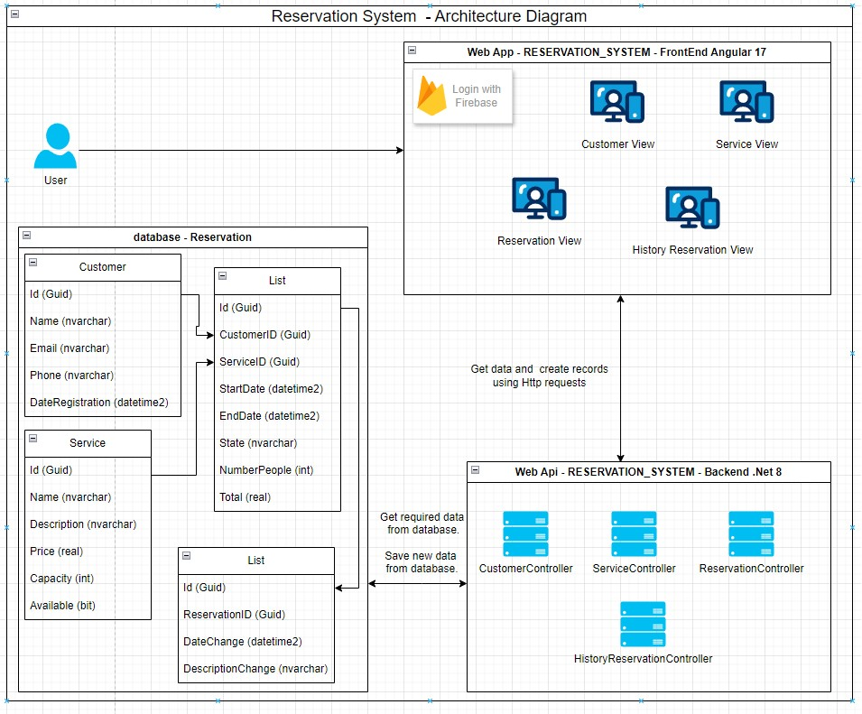

# ReservationSystem

## Descripción General

Primero se va a realizar una breve descripción del desarrollo que se realizó en el **FrontEnd** y **BackEnd**, y después se describen las consideraciones a tener en cuenta para poner en funcionamiento el "Sistema de Reservas".

---

## Descripción FrontEnd

El **FrontEnd** se construyó usando **Angular 17**. La estructura del proyecto sigue los estándares de la industria, utilizando un enfoque modular conocido como **core-shared-feature**, lo que permite una mejor mantenibilidad, escalabilidad y reutilización del código.

### Módulo Core

Contiene funcionalidades globales y transversales que son compartidas en toda la aplicación, como:

- Servicios comunes
- Guardas
- Componentes comunes como el header

El objetivo es tener elementos transversales y de una sola instancia en la aplicación.

### Módulo Shared

Contiene elementos que son compartidos por varios módulos de la aplicación, como:

- Componentes
- Servicios
- Constantes
- Interfaces

Este módulo permite la reutilización de código agrupando elementos comunes.

### Módulo Feature

Contiene componentes o elementos específicos de la aplicación. Los módulos de **Feature** pueden utilizar características de los módulos **Shared** y **Core** cuando sea necesario.

Esta modularidad facilita la escalabilidad, permitiendo agregar nuevas características sin afectar el código existente.

### Patrones de Diseño Utilizados

Durante el desarrollo, se implementaron los siguientes patrones de diseño recomendados por Angular:

- **Singleton**: Servicios anotados con `providedIn: 'root'` son instanciados una única vez y compartidos en toda la aplicación.
- **Inyección de dependencias**: Servicios que comparten la misma información.
- **Observables y RxJS**: Para manejar eventos asíncronos.
- **Resolución de Rutas**: Al definir rutas en módulos de enrutamiento.
- **Patrón AAA (Arrange, Act, Assert)**: En pruebas.
- **Mocking**: En pruebas unitarias, para simular dependencias externas.
- **Decoradores**: Añaden funcionalidad dinámica (por ejemplo, `@Component`, `@Injectable`, `@NgModule`).

---

## Descripción BackEnd

El **BackEnd** se construyó usando **.NET 8**, aplicando la **arquitectura hexagonal** o de puertos y adaptadores, junto con **CQRS** (Command Query Responsibility Segregation) para separar responsabilidades entre consultas (Queries) y operaciones (Commands).

### Capas del BackEnd

- **API**: Contiene los controladores y endpoints de la aplicación.
- **Application**: Orquesta los servicios de dominio como Commands, Queries y Handlers.
- **Infrastructure**: Implementaciones concretas de los adaptadores, comunicación con tecnologías externas y persistencia de datos.
- **Domain**: Lógica de negocio, incluyendo entidades, objetos de valor, reglas de negocio, puertos, comandos y consultas.
- **Domain.Tests**: Contiene las pruebas unitarias de la capa de dominio.

### Patrones de Diseño Utilizados

- **Inyección de dependencias**
- **Patrón AAA (Arrange, Act, Assert)**
- **Patrón Builder**
- **CQRS**
- **Decoradores**
- **DTO (Data Transfer Object)**

---

## Configuración y Ejecución de la Aplicación

---

### Descripción FrontEnd

Para correr el **FrontEnd** con **Angular**, sigue estos pasos:

1. **Tener instalada una versión de Node 20** o compatible para Angular 17+.
2. **Clonar el repositorio.**
3. Desde la terminal, ingresa a la carpeta `RESERVATION_SYSTEM.Frontend`.
4. Ejecuta el comando:
    ```bash
    npm install
    ```
    Esto instalará las librerías necesarias.
5. Inicia la aplicación con:
    ```bash
    ng serve
    ```
6. Una vez ejecutado, abre el navegador en `http://localhost:4200` para ver la aplicación.

---

### Descripción BackEnd

Para correr el **BackEnd** en **.NET 8**, sigue estos pasos:

1. **Instalar el .NET 8 SDK** desde [aquí](https://dotnet.microsoft.com/es-es/download).
2. Tener una instancia de **SQL Server** con un usuario con permisos suficientes para crear bases de datos, por ejemplo un usuario con el rol sysadmin.
3. **Clonar el repositorio.**
4. Edita el archivo `appsettings.json` en la carpeta `RESERVATION_SYSTEM.Backend\RESERVATION_SYSTEM.Api` para ajustar la cadena de conexión a SQL Server:

    ```json
    "StringConnection": "Server=localhost\\SQLEXPRESS;Database=Reservation;User Id=hsmo;Password=12345;TrustServerCertificate=True"
    ```

5. Ejecuta las migraciones de **Entity Framework** para crear la base de datos:

    a) Instala el CLI de **EF Core**:
    ```bash
    dotnet tool install --global dotnet-ef
    ```

    b) Crea la migración desde la carpeta `RESERVATION_SYSTEM.Infrastructure`:
    ```bash
    dotnet ef migrations add Inicial --startup-project ..\RESERVATION_SYSTEM.Api\RESERVATION_SYSTEM.Api.csproj
    ```

    c) Aplica la migración y crea la base de datos:
    ```bash
    dotnet ef database update -s ..\RESERVATION_SYSTEM.Api\RESERVATION_SYSTEM.Api.csproj
    ```

6. Ejecuta la aplicación con el siguiente comando desde la raíz del proyecto:
    ```bash
    dotnet run --project .\RESERVATION_SYSTEM.Api\RESERVATION_SYSTEM.Api.csproj
    ```

    La aplicación estará disponible en el puerto `5443`.

7. Abre el navegador y valida la documentación de la API en **Swagger**:
    ```bash
    https://localhost:5443/swagger/index.html
    ```

--- 

Con lo anterior ya deberia de poder ver la aplicacion funcionando correctamente.

Como datos adicionales, a continuacion se muestra un diagrama de la arquitectura usada para desarrollar la aplicacion y la documentacion de la api que se genera con swagger.




[Descargar socumentacion de la api con swagger](./DocumentationWithSwaggerWebApi/DocumentationWithSwagger.json)

